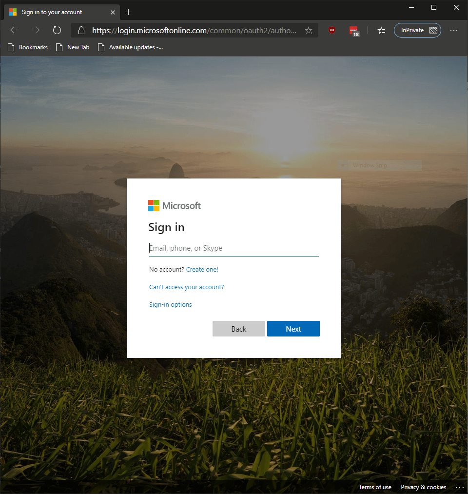
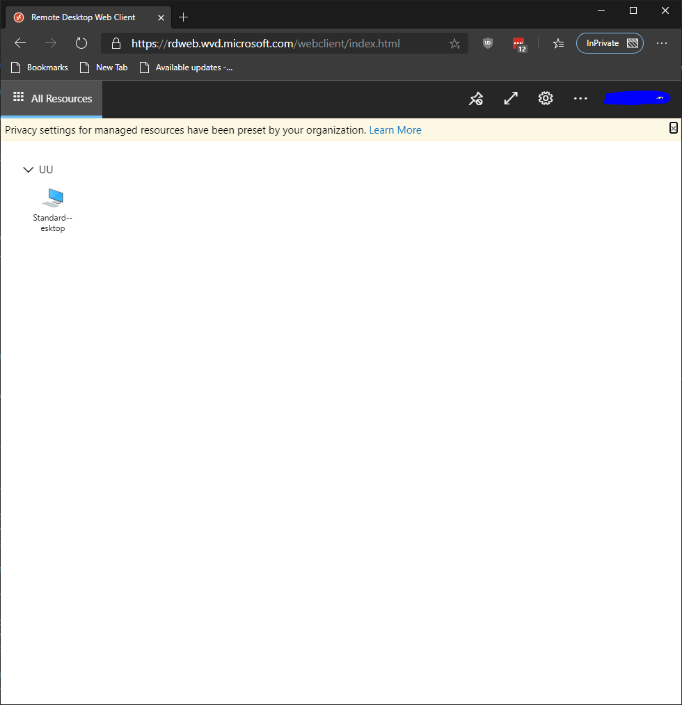
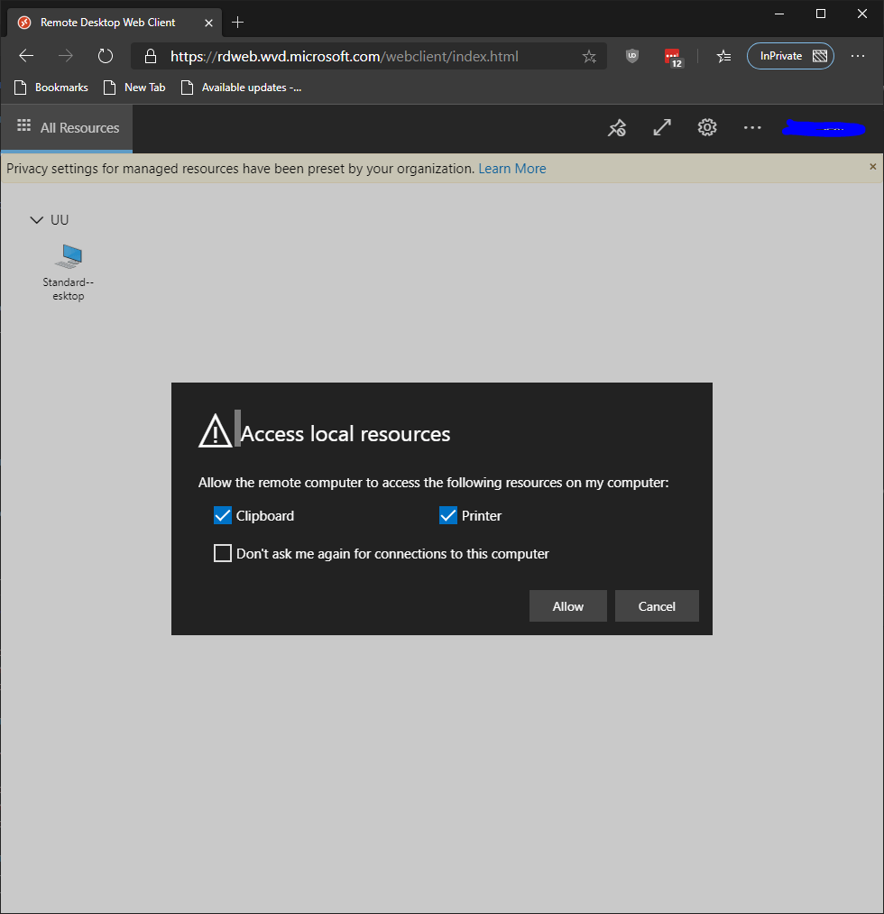
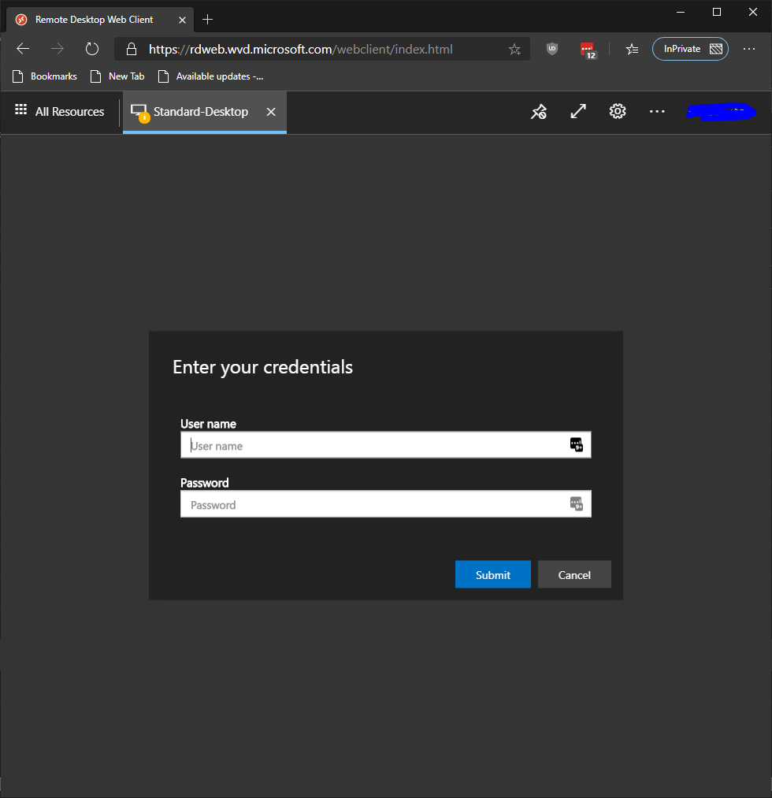

# Accessing Union Windows Virtual Desktop

## Accessing from Web Browsers

> [!NOTE]
> **Recommended Browsers**
> 
> - Google Chrome
> - Mozilla Firefox
> - Apple Safari
> - Microsoft Edge

### Accessing Virtual Desktop

1. **In a recommended browser, navigate to the [https://rdweb.wvd.microsoft.com/webclient](https://rdweb.wvd.microsoft.com/webclient) and sign in with your user account.**
    

1. **Double Click Standard Desktop**
    

1. **Click Allow for Access Local Resources**

    

1. **Enter Username and Password**

    

> [!NOTE]
> First Login will take a few moments as it sets up your user profile and will automatically setup OneDrive Client.                                                    