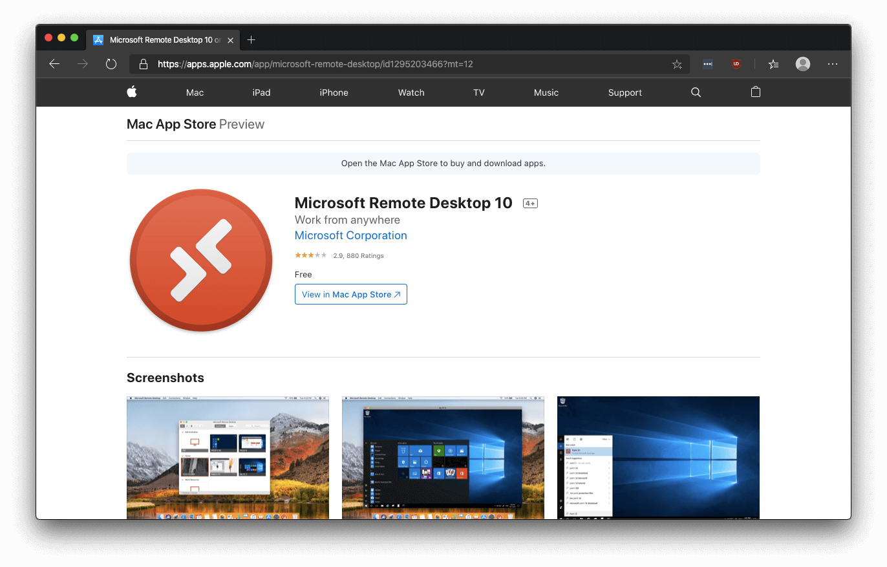
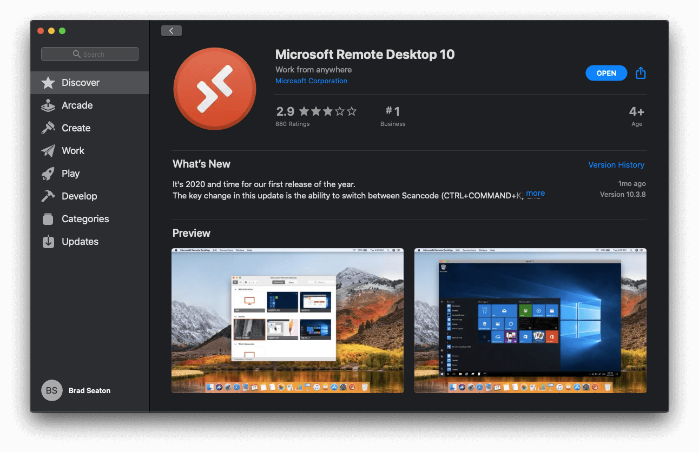
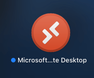
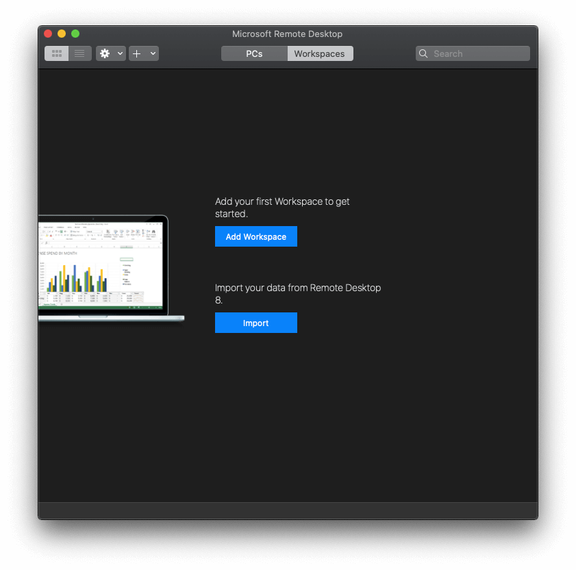
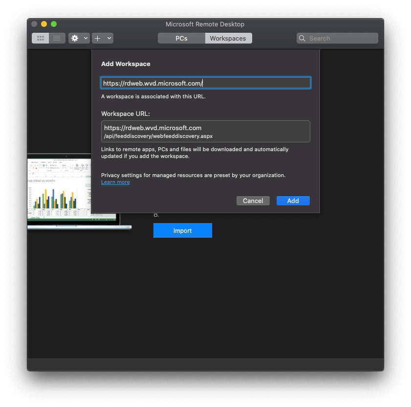
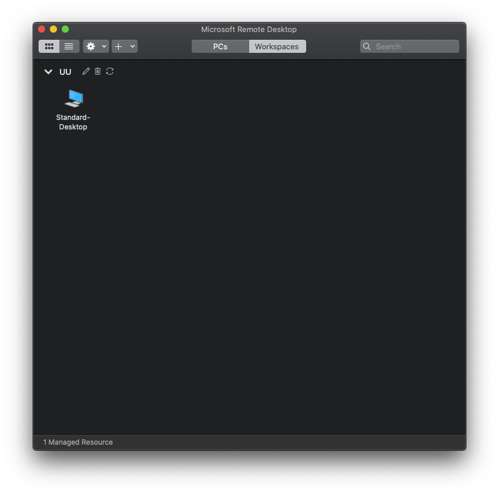
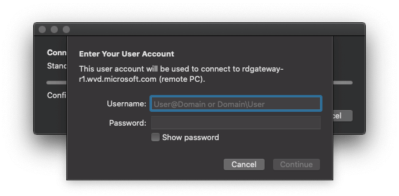

# Accessing Union Windows Virtual Desktop

## Accessing from macOS

1. **Download Client from AppStore [Remote Desktop Client](https://apps.apple.com/app/microsoft-remote-desktop/id1295203466?mt=12) Click View in Mac App Store**

    

1. **Install the client from AppStore**

    

1. **Launch Remote Desktop Application**

    

1. **Click Workspace then Click Add Workspace**

    

1. **Enter https://rdweb.wvd.microsoft.com for the URL and Add**

    

1. **Double Click Standard Desktop**

    

1. **Enter Username and Password**

> [!NOTE]
> First Login will take a few moments as it sets up your user profile and will automatically setup OneDrive Client.