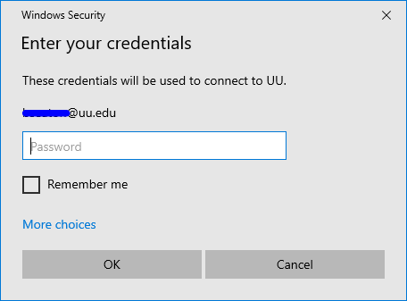

# Accessing Union Windows Virtual Desktop

## Accessing from Windows

1. **Download Windows Client https://go.microsoft.com/fwlink/?linkid=2068602**

1. **Install Client once downloaded (RemoteDesktop\_1.2.xxx\_x64.msi)**
1. **Click Next**

     

1. **Accept Agreement and Click Next**

     

 
1. **Choose Install Just for you and click Install**

     

1. **Click Subscribe to a feed**

     

1. **Login with your Union Account Information.**
    
     

1. **Double Click Standard-Desktop**

     

1. **Enter your username and password**

     

> [!NOTE]
> First Login will take a few moments as it sets up your user profile and will automatically setup OneDrive Client.                                                                                                                                                                                    